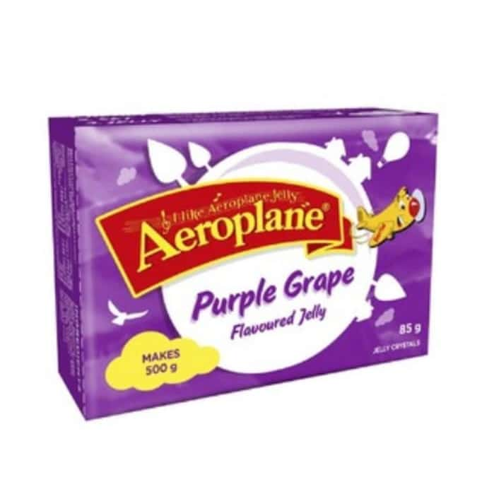

<!--
date: 2026-03-10
tags: jelly, australian
-->

# Aeroplane Jelly Purple Grape

*March 2026 — Review*

---

Looks good, smells good, tastes good. Classic. We are well and truly abstracted away from any real grape at this point, this is its own thing now, a flavour that exists in its own right, and it's a good one.

You have to make it right though. Can't be dealing with jelly that still has crystals in it. Set it properly or don't bother. When it's done correctly it's genuinely yummy. Strong flavour, good wobble, does exactly what it promises.

There's no pretending this is sophisticated. It's Aeroplane Jelly. It's purple. It's grape. That's the whole thing, and honestly that's fine. Some things don't need to be more than they are.

---

The Verdict

Satisfaction

Genuinely yummy

Real Grape Taste

Conceptual at best

Crystal Risk

User error dependent

