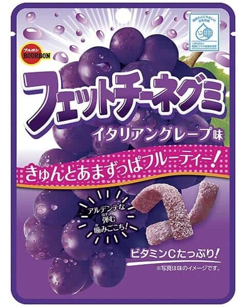

<!--
date: 2026-03-05
tags: japanese, gummy
-->

# Bourbon Fettuccine Gummy Grape

*March 2026 — Review*

---

Yum. Classic yummy grape flavour. Strong, immediate, no ambiguity. You know what you're eating and it's good.

Sugar coated so they don't stick together, which is a smart practical detail that also adds a nice crunch before the chew starts. The "fettuccine" of it all is really pretty arbitrary. It's basically just thin worms. But naming aside, they're really yummy and very satisfying.

Would like a bit more chew. These are on the softer side and they don't last as long as you'd want. You want a bit more resistance, a bit more time with each piece. But the flavour is great, and that counts for a lot.

---

The Verdict

Satisfaction

Quite satisfying

Grape Flavour

Classic and strong

Fettuccine-ness

Thin worms

