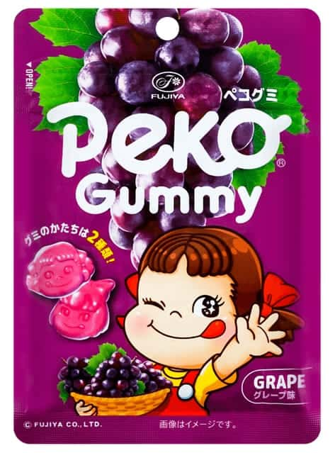

<!--
date: 2026-08-28
tags: japanese, gummy, update
-->

# Fujiya Peco Gummy Grape — An Update

*August 2026 — Review*

---

Still absolutely disgusting. I don't think I went far enough in the first review, which is saying something given that I compared it to bin juice and BO. Reading it back now, it feels generous.

I left room for the possibility of a bad batch. Said the chew was acceptable. Tried to find something to work with. The problem is that none of that gets you past having to taste it. A technically acceptable gummy is not much use when eating it is the worst part.

This could ruin your whole day. You could be having a perfectly nice time, eat one of these, and that's what the day is about now. Everything else has to happen around the fact that you ate it.

Could put you off food altogether, honestly. Not just grape gummies. Food. An extraordinary result for something sold as a treat.

[Read the original review](/food/posts/fujiya-peco-grape/).

---

The Verdict

Satisfaction

Previously overstated

Day Ruination

Entirely possible

Faith in Food

Hanging by a thread

