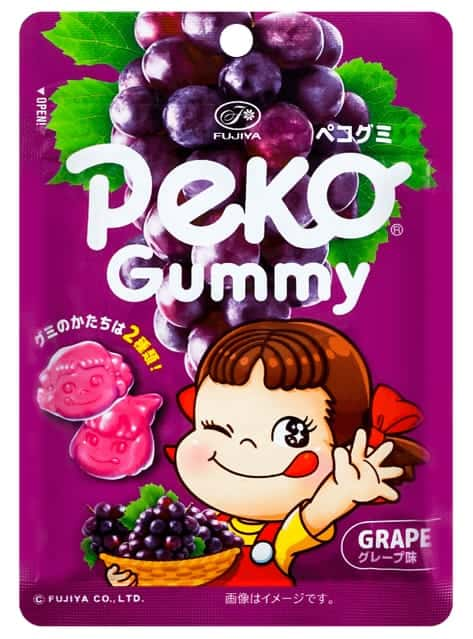

# Fujiya Peco Gummy Grape

*March 2026 — Review*

---

The packaging said this was still in date, but it tasted rancid. Really like eating bin juice that's been set in gelatine. Like eating BO, really bizarre to be honest.

Also had an awful texture. Some sort of very light weird powder residue on the gummies? Not a pleasant sugar coating, something else entirely. Cosmetic almost. No idea what it was or what it was meant to be doing. It wasn't helping.

Horrible. Disgusting really.

The gummy texture was fine, I'll give it that. Outside of the weird powder on top, the actual chew was acceptable. But the flavour was so bad that it barely matters.

Might have to try again to check if this is really how it's meant to taste. I'm open to the possibility of a bad batch. But the memory of this one is going to make that a difficult decision.

---

The Verdict

Satisfaction

Profoundly absent

Bin Juice

Unmistakable

Mysterious Powder

Unexplained

