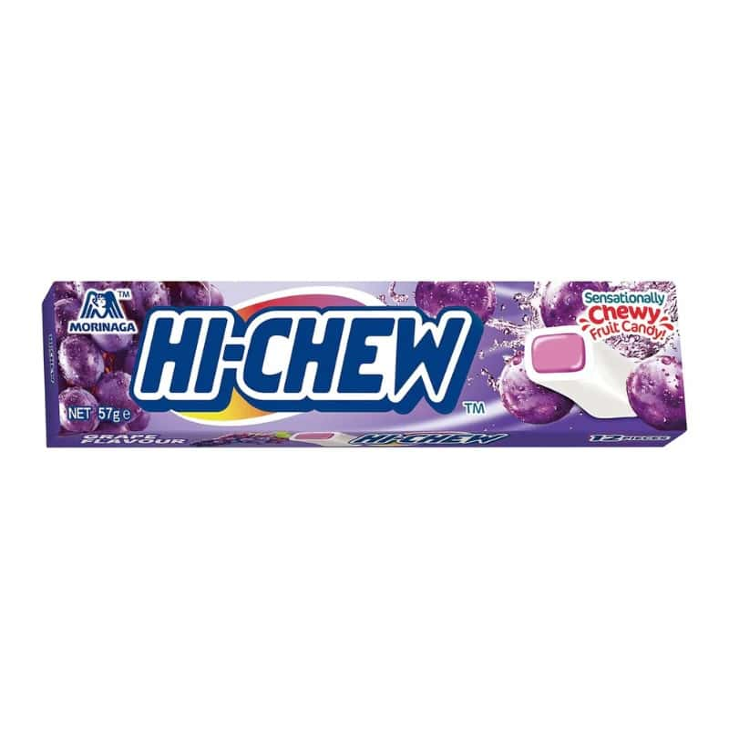

<!--
date: 2026-03-05
tags: japanese, chew
-->

# Hi-Chew Grape

*March 2026 — Review*

---

Really great. Got that artificial flavour I love but it's not overwhelming. Comes out more while chewing, which makes it more rewarding than a lolly that hits you with everything upfront and then has nowhere to go. Very satisfying. Want to go back for more and more and more.

The chew is good. Firm enough, soft enough. The flavour holds the whole way through and doesn't fade into a waxy nothing like some chews do. The artificial grape register is exactly right. No pretence of being natural, just a confident, well-executed flavour that knows what it's doing.

Packet disappears fast.

---

The Verdict

Satisfaction

Very high

Moreishness

Dangerously high

