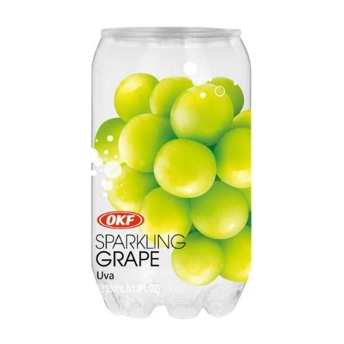

<!--
date: 2026-07-16
tags: korean, soft drink, novelty
-->

# OKF Sparkling Grape Can

*July 2026 — Review*

---

Pretty nice and refreshing. Really fun clear plastic "can". You can see the drink through it! I know you can see through a bottle as well, but this is shaped like a can, and apparently that's enough to get me interested.

The grape flavour needs to do a bit more though. It's a pleasant drink, just not grape flavoured enough. I kept wanting more from it. Doesn't need to become grape concentrate, but a bit more commitment would help.

The packaging is doing a fair amount of the work here. I like looking at it. I like that they've made a can you can see into. None of this makes it taste more like a grape, unfortunately.

Would happily drink it for the refreshing part. For the grape part, there's room for improvement. Very good container.

---

The Verdict

Satisfaction

Nice and refreshing

Can Fascination

You can see inside

Grape Commitment

Could do more

