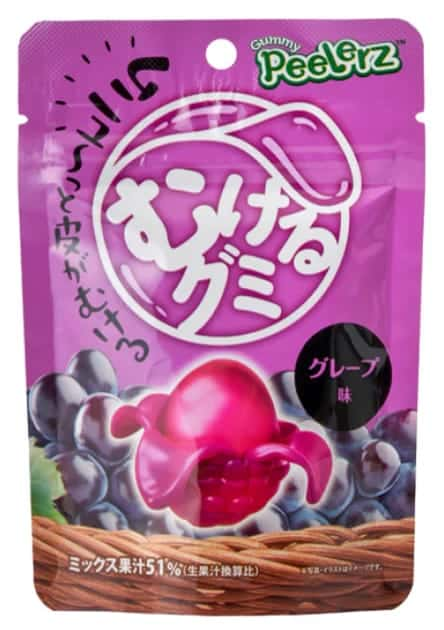

<!--
date: 2026-03-05
tags: japanese, gummy, novelty
-->

# Peelerz Gummy Grape

*March 2026 — Review*

---

Interesting idea. Can be eaten multiple ways. Has a tougher "peelable" outside layer and a softer inside, so the concept is that you peel the layers apart before eating.

Peeling isn't particularly intuitive though. It doesn't *look* peelable, and to peel it you just kind of have to tear this tough layer. There's no seam, no obvious starting point. You just rip at it. Not particularly satisfying as an interaction.

Not a great grape flavour and not a very strong flavour of anything overall. You can tell grape was the intention but it's quiet and noncommittal. The dual texture thing also means neither layer really works on its own. The outside is too tough, the inside is too soft. Together it's fine but nothing more than fine.

You can just eat it whole and skip the peeling entirely, which is probably the move. But then you wonder why you bought a Peelerz.

---

The Verdict

Satisfaction

Not great

Peelability

Barely

