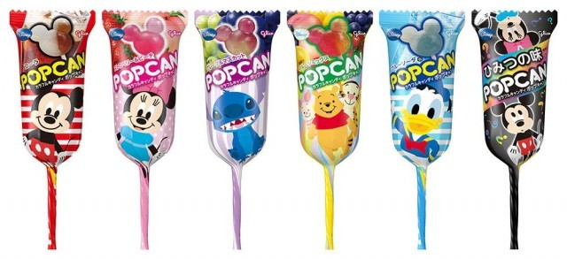

<!--
date: 2026-05-09
tags: japanese, lollipop
-->

# Popcan Grape

*May 2026 — Review*

---

Nicely shaped lollipop. That's the first thing to say for it, and probably the strongest thing to say for it. A pleasing little object. Someone has thought about the shape and it's worked.

The flavour isn't bad. Quite happy eating it on that basis. No discernible grape flavour though, which is a fairly significant omission for the purposes of this publication. Not a weak grape flavour. Just nothing I could confidently point to and say yes, that's grape.

It's an odd one because there's nothing especially unpleasant happening. If you handed it to me without telling me the flavour I'd probably think it was fine. Telling me it's grape gives me something to look for, and I can't find it.

Nice shape. Fine lolly. Grape remains unaccounted for.

---

The Verdict

Satisfaction

Fine as a lolly

Shape Appeal

Nicely done

Grape Detectability

Still looking

