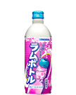

<!--
date: 2026-04-18
tags: japanese, soft drink
-->

# Sangaria Grape Soft Drink

*April 2026 — Review*

---

Quite nice. Not as deep purple as other grape drinks I've had, which isn't necessarily a bad thing. Maybe they're going for accuracy. Actual grapes do exist, even if this publication doesn't spend much time with them.

The flavour is gentler too. Doesn't whack you over the head with grape, just gets on with being a nice drink. I do like a strong artificial grape flavour, but there's something to be said for being able to take a sip without the whole thing becoming an event.

The lighter colour had me wondering if it would taste like not much at all. It tastes like enough. There's a difference between holding back a bit and forgetting to put the flavour in, and this stays on the right side of it.

Pretty happy with this. Purple enough. Grape enough. Doesn't need to shout.

---

The Verdict

Satisfaction

Quite nice

Purple Depth

Showing restraint

Flavour Intensity

No head whacking

