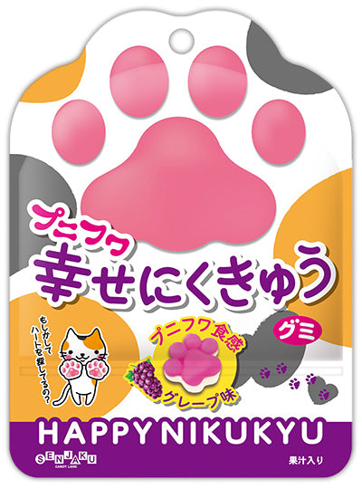

<!--
date: 2026-06-23
tags: japanese, gummy, novelty
-->

# Senjaku Happy Nikukyu Paw Print Gummy Grape

*June 2026 — Review*

---

Pretty nice! Good bite, good chew, nice flavour. Little paw prints. Quite a lot going for them!

Usually less into gummies with the white bit behind them. It so often adds this nothing-y layer that you have to get through to get back to the good part. Doesn't contribute much flavour, doesn't improve the chew. Just takes up space that could have been more gummy.

This was good though. The bite still works, there's a satisfying chew, and the flavour is nice enough that I wasn't sitting there wishing half of it away. The white bit gets to stay. Didn't expect to be making that concession, but here we are.

A good little gummy. Happy to be wrong about the backing. Still suspicious of the others.

---

The Verdict

Satisfaction

Pretty happy

Bite and Chew

Both accounted for

White Bit Redemption

An exception is granted

